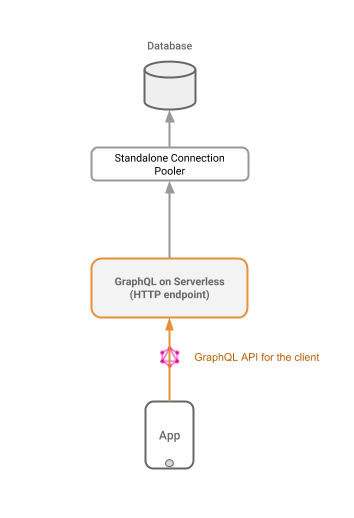

# GraphQL Serverless

This repository contains a set of GraphQL backend boilerplates that can be deployed on serverless platforms like AWS Lambda.

## The Fundamental Problem: Database Connections

In theory, hosting a GraphQL backend on serverless is very useful. Serverless gives a scalable and "no-ops" platform to deploy applications instantly. Although in practice, there is a fundamental bottleneck when using it for something like a GraphQL backend: **state management**.

Serverless backends cannot hold state between different requests. This means that state must be recreated in each serverless request. In the case of a GraphQL backend, a database connection must be created and destroyed in each request which not only is very slow in performance but also consumes the database resources very quickly.

In this repo, we show a way to mitigate this problem by using a lightweight connection manager to loadbalance the requests to the database.

## Connection Pooling

Without connection pooling our GraphQL backend will not scale at the same rate as serverless invocations. With Postgres, we can add a standalone connection pooler like [pgBouncer](https://pgbouncer.github.io/) to proxy our connections.



We will deploy pgBouncer on a free EC2 instance. We can use the CloudFormation template present in this repo: [cloudformation.json](cloudformation/cloudformation.json) to deploy a pgBouncer EC2 instance in few clicks.

#### Results

Using pgBouncer, here are typical results for corresponding rate of Lambda invocations. The tests were conducted with the `addUser` mutation using [jmeter](https://jmeter.apache.org/).

|  Error Rate -> | Without pgBouncer | With pgBouncer|
| -------------- | ----------------- | ------------- |
| 100 req/s      | 86%               | 0%            |
| 1000 req/s     | 92%               | 4%            |
| 10000 req/s    | NA                | 3%            |

Note: The table above indicates the success (2xx) or failure (non-2xx) of requests when instantiated at X req/s and not the throughput of those requests.

## Getting Started

Get started with the following languages and serverless platforms:

[NodeJS + AWS Lambda](aws-nodejs/apollo-sequelize)

[Python + AWS Lambda](aws-python/graphene-sqlalchemy)

[Go + AWS Lambda](aws-go/graphqlgo-gorm)

These are basic "Hello World" boilerplates with the following GraphQL schema:

```
type User {
  id:       Int
  name:     String
  balance:  Int
}

type Query {
  hello:  String
  users:  [User]
}

type Mutation {
  addUser(name: String, balance: Int): User
  transfer(userIdFrom: Int, userIdTo: Int, amount: Int): User
}
```

### Using with Hasura GraphQL Engine (Optional)

While you can use these boilerplates to create any kind of GraphQL schema, you may wish to merge your schema with [Hasura GraphQL Engine](https://hasura.io) to augment your schema with a wide range of CRUD APIs.

Follow this guide to merge your schema with Hasura: [using-with-hasura.md](using-with-hasura.md)

## CONTRIBUTING

We strongly encourage contributions of boilerplates in other languages, frameworks/ORM or serverless platforms. Please follow [CONTRIBUTING.md](CONTRIBUTING.md) for guidelines on contributing.

Check out some of the [open issues](https://github.com/hasura/graphql-serverless/issues?q=is%3Aissue+is%3Aopen+label%3A%22help+wanted%22) which require community help.
